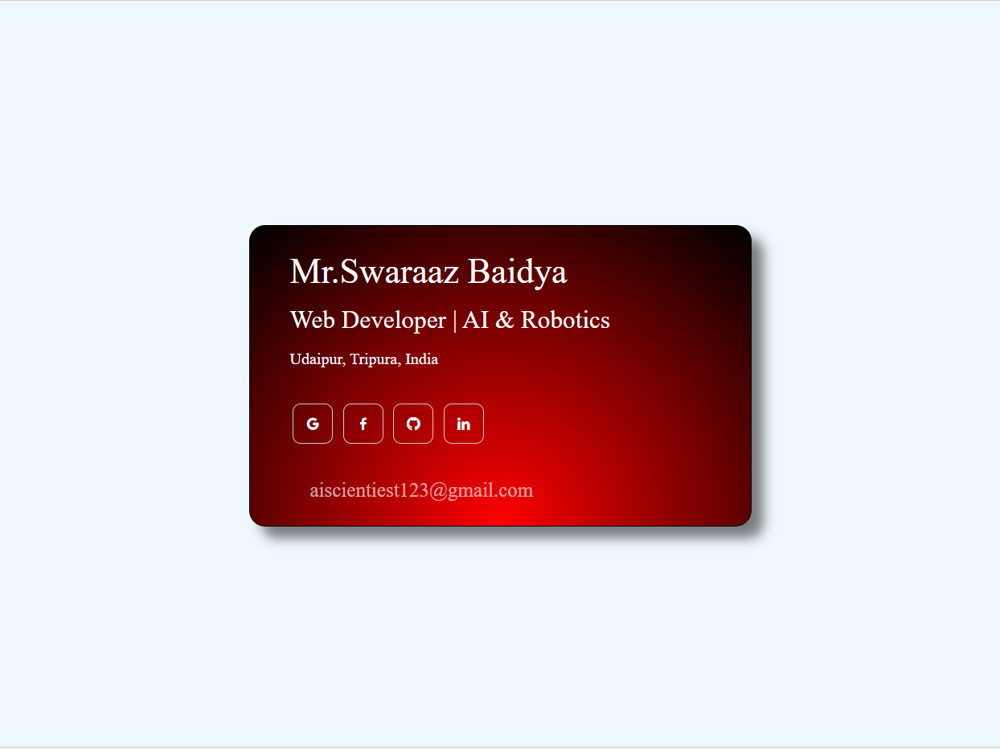

# 🎨 Personal Bio Card UI (Neumorphism Style)

A simple **personal bio card** user interface designed using **advanced HTML** and **advanced CSS only**.  
This project demonstrates modern CSS design concepts like:

---

### ✨ Features:
- ✅ Neumorphism effect
- ✅ CSS Variables
- ✅ Grid Layout
- ✅ Linear Gradient background
- ✅ Box Shadows for soft neumorphic feel

---

### 🚀 Technologies Used:
- HTML5
- CSS3 (with advanced styling)

---

### 📸 Preview:



---

### 📁 Folder Structure: 

```
Personal-Bio-Card/
 ├── README.md
 ├── Bio_Card_Screenshot.png
 ├── index.html
 └── style.css
```

---

**🔗 Author:** [Swaraaz Baidya](mailto:aiscientiest123@gmail.com)